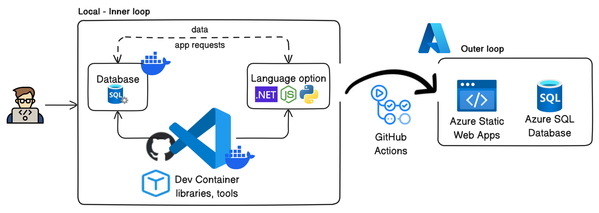

# Azure SQL Database Dev Container Templates

<table style="width: 100%; border-style: none;">
<tr>
<td style="width: 140px; text-align: center;">

</td>
<td>
<strong>Azure SQL Database Dev Container Templates</strong> 
Streamlined development environments for Azure SQL Database using Dev Containers.
</td>
</tr>
</table>

## Overview

In the quest to enhance local development for Azure SQL Database, this repository provides a comprehensive solution leveraging the power of Dev Containers. These templates offer developers a seamless and efficient development environment, enabling them to build applications for Azure SQL Database with ease and confidence. Dev Containers can be utilized in any development environment, including the cloud, promoting consistency across teams and workflows.

Our Dev Container templates simplify the development process by providing pre-configured environments that eliminate the need for manual setup. Developers can start coding immediately with all necessary tools and dependencies in place, using popular languages like `.NET`, `Node.js`, and `Python`.

The local development environment mimics Azure SQL Database, allowing developers to manage data and test applications efficiently. Once ready, **GitHub Actions** automate the deployment process, transitioning seamlessly to **Azure Static Web Apps** and **Azure SQL Database**. This streamlined workflow enhances productivity, reduces setup time, and ensures consistency between local and production environments, helping developers deliver high-quality applications faster.

Thank you for joining us on this journey to enhance the Azure SQL Database development experience. We look forward to your feedback and contributions!

## Problem Statement

Developers face significant challenges in setting up efficient local development environments for Azure SQL Database:

- **Lack of Compatibility**: Discrepancies between local development and production environments.
- **Setup Complexity**: Time-consuming manual installations and configurations.
- **Dependency on Cloud Resources**: Increased cloud costs and reliance on internet connectivity.
- **Limited Integration**: Lack of integration with existing Azure development tools.

### Addressing the Gap in Local Development Environments

We recognize the need for efficient local development environments tailored to Azure SQL Database. Our Dev Containers bridge this gap, enhancing developer experiences and fostering innovation within the Azure ecosystem. This initiative positions Azure SQL Database as a versatile and developer-centric platform.

### Accelerating Time-to-Market

Dev Containers streamline the development lifecycle, enabling developers to focus on coding and testing without the hassle of environment setup. This efficiency leads to faster iterations, higher-quality applications, and a reduced time-to-market for applications built on Azure SQL Database, giving businesses a competitive edge.

### Cost-Efficiency and Scalability

Local development with Dev Containers reduces cloud costs associated with development and testing in Azure environments. This optimization of resources improves cost-efficiency and scalability. Developers can transition seamlessly from local development to Azure environments, leveraging the scalability and reliability of Azure SQL Database for production deployments without incurring unnecessary costs.

### Alignment with Cloud-Native Trends

Dev Containers support cloud-native development scenarios, aligning with modern application architectures and frameworks. This ensures compatibility with Azure SQL Database and facilitates seamless deployment to Azure environments. By embracing cloud-native trends, we position Azure SQL Database as the platform of choice for modern, cloud-native applications, driving long-term adoption and revenue growth.

## Why Dev Containers, Docker, and VS Code?

Dev Containers, Docker, and VS Code are pivotal tools for modern developers:

- **Docker**: Provides portable and reproducible environments.
- **VS Code**: Popular IDE with robust features and extensibility.
- **Dev Containers**: Offer a seamless transition from local development to Azure environments, reducing setup complexity and promoting efficiency.

## Value Proposition

Adopting Dev Containers for Azure SQL Database development offers several advantages:

- **Efficient Local Development**: Streamlines the setup process, saving time and reducing errors.
- **Cost-Efficiency**: Reduces cloud costs by enabling local development.
- **Faster Time-to-Market**: Accelerates development cycles, leading to quicker application releases.
- **Alignment with Cloud-Native Trends**: Supports modern application architectures and frameworks.

## Available Templates

This repository includes Dev Container templates for the following frameworks:

- .NET Aspire

Each template comes with a pre-configured Azure SQL Database, making it easy to start developing right away.

## Contributions

### Creating your own collection of templates

The [Dev Container Template specification](https://containers.dev/implementors/templates-distribution/#distribution) outlines a pattern for community members and organizations to self-author Templates in repositories they control.

### Contributing to this repository

This repository will accept improvement and bug fix contributions related to the
[current set of maintained templates](./src).

## Feedback

Issues related to these templates can be reported in [an issue](https://github.com/microsoft/azuresql-devcontainers/issues) in this repository.

# License
Copyright (c) Microsoft Corporation. All rights reserved.  
Licensed under the MIT License. See [LICENSE](LICENSE).