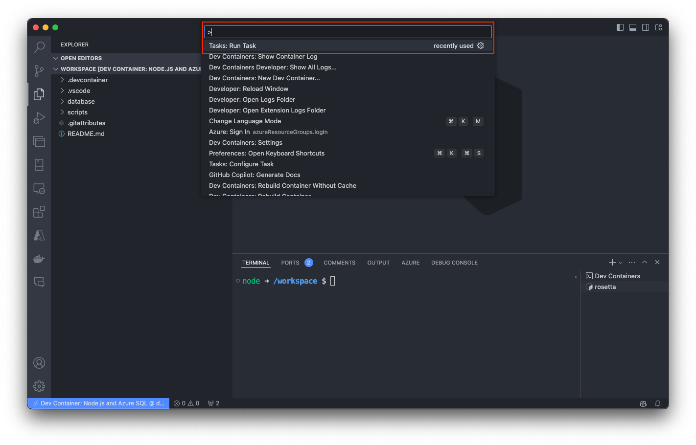
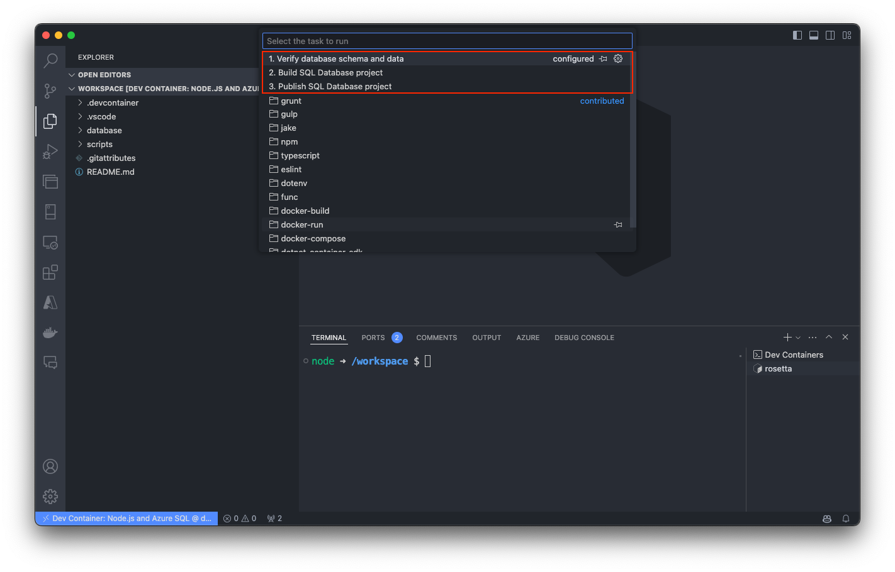
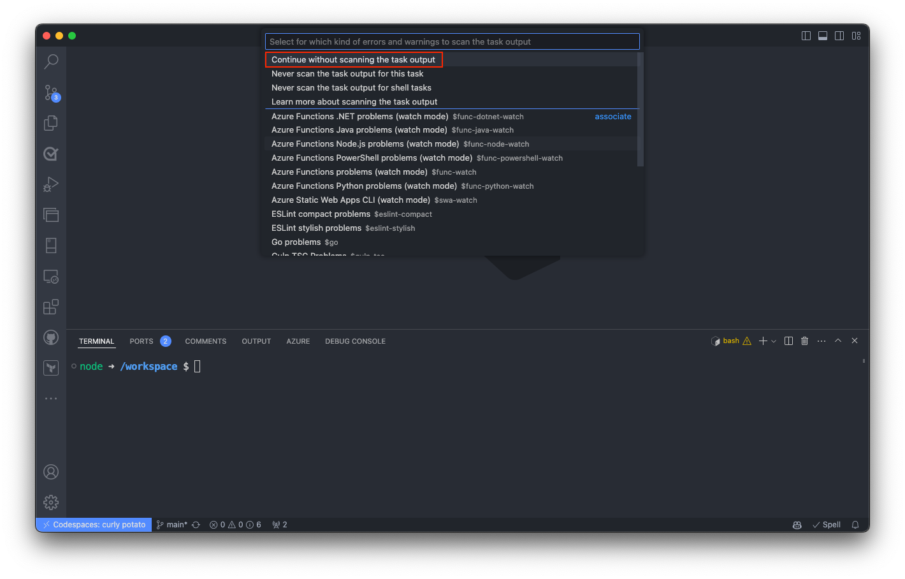
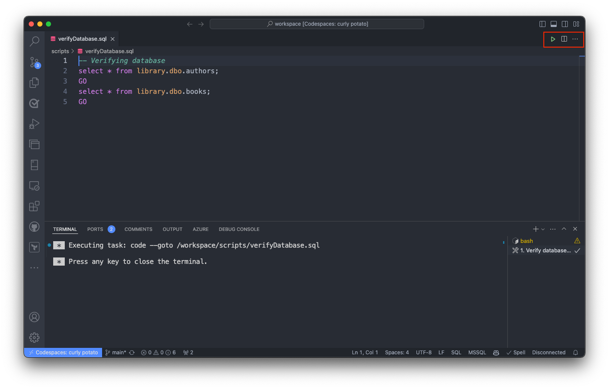
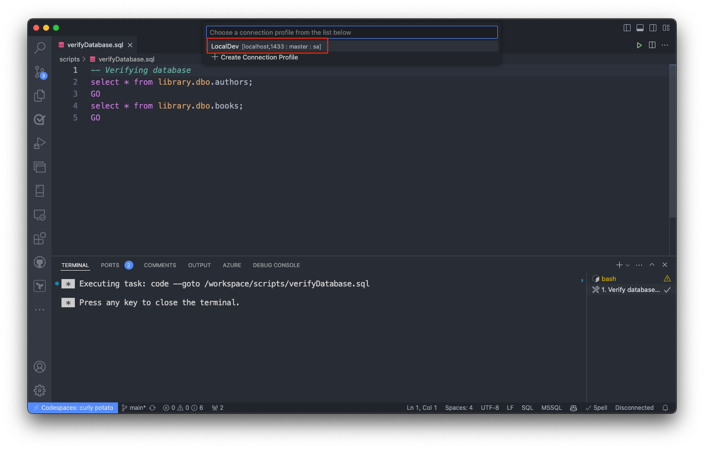
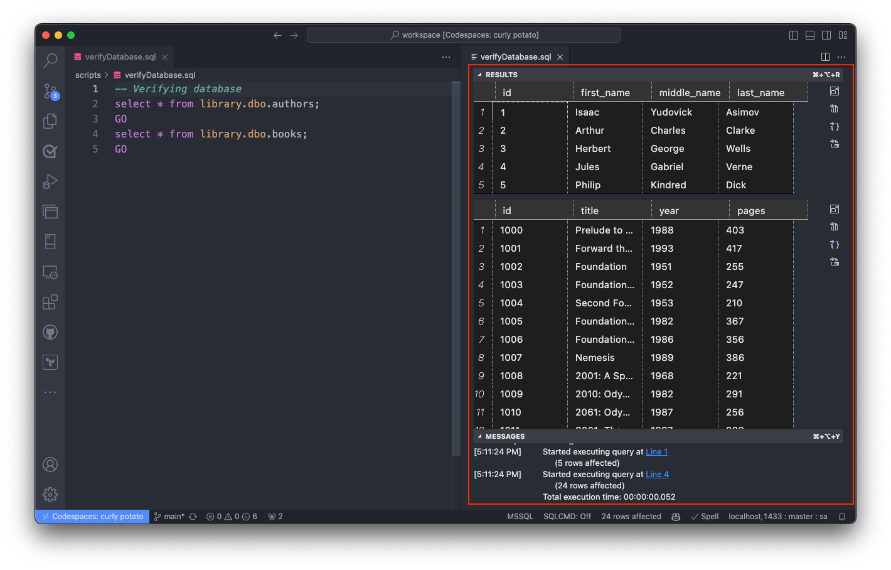
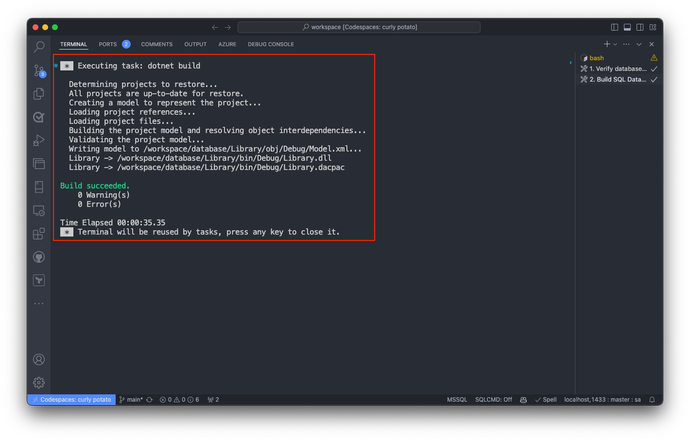
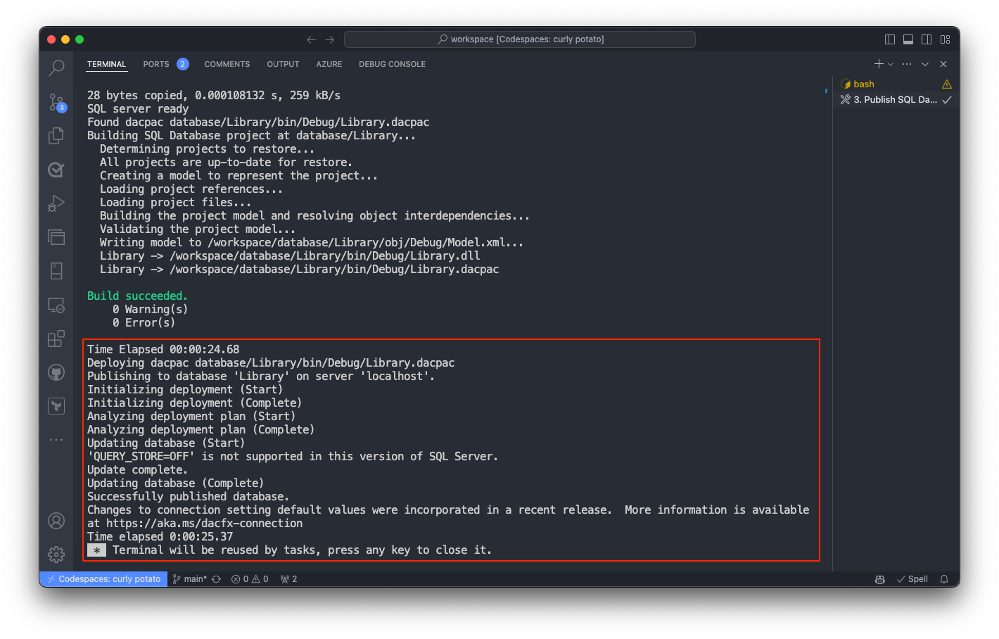

This dev container template enables you to effortlessly explore **.NET Aspire** and **Azure SQL**. In just a few simple steps, you can dive into the capabilities of these powerful technologies.

A **development container** (dev container for short) essentially packages up your project's development environment using the Development Container Specification. This specification enriches your container with metadata and content necessary to enable development from inside a container.

 You can try out dev containers with **[GitHub Codespaces](https://github.com/features/codespaces)** or **[Visual Studio Code Dev Containers](https://aka.ms/vscode-remote/containers)**.

To learn more details about all the Azure SQL Database templates, you can explore the template repository at [aka.ms/azuresql-devcontainers-repo](https://aka.ms/azuresql-devcontainers-repo). This repository includes comprehensive information for each Azure SQL template. To learn more about Dev Containers, visit [containers.dev](https://containers.dev/) website, where you find a diverse range of templates.

> [!NOTE]
> If you already have a VS Code Dev Container or a GitHub Codespace, you can jump to the [About this template](#about-this-template) section.

## Setting up the development container

### Visual Studio Code

Follow these steps to open this sample in a container using the VS Code Dev Containers extension:

1. If you're using a dev container for the first time, ensure your system meets the prerequisites in the [getting started steps](https://aka.ms/vscode-remote/containers/getting-started).
2. To use this repository, you can either open the repository in an isolated Docker volume:
    - Press `F1` or `Ctrl+Shift+P` to open the command palette.
    - Select the **Dev Containers: New Dev Container** command.
    - Select the desired dev container template for Azure SQL Database, typing **Azure SQL**.
    - Select the **.NET with Aspire and Azure SQL (dotnet-aspire)** template
    - Wait for the container to build.
        - Visual Studio Code builds the container based on the selected configuration.
        - The build process might take a few minutes the first time.
        - Subsequent builds are faster.
    - Once the container is built, the repository opens in the dev container.

For more information, see the [Dev Containers tutorial](https://code.visualstudio.com/docs/devcontainers/tutorial).

> [!NOTE]
> Under the hood, this will use the **Dev Containers: Clone Repository in Container Volume...** command to clone the source code in a Docker volume instead of the local filesystem. [Volumes](https://docs.docker.com/storage/volumes/) are the preferred mechanism for persisting container data.

### GitHub Codespaces

To set up and use a dev container with GitHub Codespaces, follow these steps:

1. **Prerequisites**
    - Ensure you have access to GitHub Codespaces.
    - Ensure your repository is hosted on GitHub.

2. **Create or Open a Codespace**
    - Navigate to your repository on GitHub.
    - Click on the **Code** button, then select **Codespaces**.
    - Click **New codespace** to create a new one or **...** next to an existing codespace to open it.

3. **Set Up the Development Container**
    - Once your codespace is running, open the command palette by pressing `F1` or `Ctrl+Shift+P`.
    - Type and select **Dev Containers: Add Development Container Configuration Files...**.
    - From the list, select **Show All Definitions...**.
    - Type **Azure SQL** to filter the list.
    - Select the **.NET with Aspire and Azure SQL (dotnet-aspire)** template.
    - The selected template will be added to your repository, creating a `.devcontainer` folder with configuration files.

4. **Rebuild the Codespace**
    - To apply the new configuration, you need to rebuild the codespace.
    - Open the command palette by pressing `F1` or `Ctrl+Shift+P` again.
    - Type and select **Codespaces: Rebuild Container**.
    - Wait for the container to rebuild. This might take a few minutes the first time as it pulls and sets up the necessary images and configurations.

5. **Using the Dev Container**
    - Once the container is built, your codespace will restart in the new development environment.
    - You can now start exploring and developing with the preconfigured .NET Aspire and Azure SQL setup.

> [!NOTE]
> The `.devcontainer` folder includes configuration files like `devcontainer.json`, `docker-compose.yml`, and supporting scripts for setting up and managing the development environment.

### About this template

This Dev Container includes a preconfigured database, specifically tailored for use with .NET Aspire. This database serves as a foundation for demonstrating how .NET Aspire interacts with Azure SQL.

This template creates two containers: one for container that includes .NET Aspire, and one for the database. You will be connected to the Ubuntu environment, and from within that container, the database container will be available on **`localhost`** port 1433. The dev container also includes a set of VS Code tasks that can help you to verify the database schema and data, as well as build and publish the database project to the database container.

The database container (SQL-Library) is deployed from the latest developer edition of Azure SQL Edge. The database(s) are made available directly in VS Code through the MSSQL extension with a connection labeled **LocalDev**. The default `sa` user password is set using the `.devcontainer/.env` file. The default SQL port is mapped to port `1433` in `.devcontainer/docker-compose.yml`.

.NET Aspire is a cutting-edge framework crafted for developing cloud-native applications, with a primary focus on containerized environments. Aspire, built with .NET Core, empowers developers to architect scalable and resilient applications optimized for cloud deployment.

> [!IMPORTANT]
> While the database container employs a development version of Azure SQL Edge , all database development within this dev container can be validated for Azure SQL Database using the SQL Database Project. The SQL Database project is preconfigured with the target platform set as Azure SQL Database.
>
> To learn more about the SQL Database Projects extension, visit the [Getting started with the SQL Database Projects extension](/azure-data-studio/extensions/sql-database-project-extension-getting-started).

### Preconfigured Environment

All of the below tools and utilities are pre-loaded in the Dev Container. You don't need to download or install!

- **.NET** : The environment includes your preferred programming language/framework preinstalled and configured, ready for development.
- **Azure CLI**: Tools for managing Azure resources and deployments.
- **Azure Developer CLI**: A command-line interface providing a unified scripting experience for managing and developing Azure resources.
- **Docker CLI**: Allows building and managing Docker containers from within another container.
- **Azure SQL Database**: The `library` database was created, validated, and is ready for use. This database gives you full compatibility with Azure SQL Database.
- **SQLCMD**: A command-line utility you can use to interact with the database, run queries, and more.
- **SqlPackage**: Command-line utility for deploying database changes, including schema updates and data migrations.

### Visual Studio Code Extensions

- `ms-mssql.mssql`: SQL Server extension for connecting and querying SQL databases.
- `ms-mssql.sql-database-projects`: Extension for managing SQL Database projects, allowing for streamlined schema changes and deployment.
- `github.copilot`: AI-powered code completion for enhanced productivity.
- `ms-azuretools.vscode-docker`: Docker extension for managing containers directly from Visual Studio Code.
- `github.codespaces`: Extension for working with GitHub Codespaces.
- `ms-azuretools.vscode-docker`: Docker extension for managing containers.

> [!TIP]
> There will be more extensions available depending on the template you choose. You can install additional extensions by opening the Extensions view in Visual Studio Code and searching for the desired extension.

#### Visual Studio Code Tasks

This dev container template includes multiple tasks that can help with common actions. You can access these tasks by opening the Command Palette in VS Code. Here's how:

1. To open the Command Palette, press <kbd>F1</kbd> or <kbd>Ctrl</kbd>+<kbd>Shift</kbd>+<kbd>P</kbd>. Type **Run Task** and select **Tasks: Run Task**.

1. Choose one of the tasks you want to run from the built-in list included in this Dev Container template.


##### 1. Verify database schema and data

This task is optional, however it can help you to become familiar with the sample `Library` database tables and data included in this dev container template.

From the built-in tasks included in this dev container template, select `1. Verify database schema and data` to run this task.


Select `Continue without scanning the task output` when prompted.


The task opens the `verifyDatabase.sql` file in your workspace and leaves the same ready to be executed using the `ms-mssql.mssql` extension. Then, select the "Run" button or press `F5` to execute the script.


Select the built-in connection **LocalDev** to connect to the database and execute the script. 


The results of the SQL script will be displayed in the output window.


##### 2. Build SQL Database project

This task is optional, but it's useful to verify the database schema. You can use this SQL Database project to make changes to the database schema and deploy it to the SQL Server container.

From the built-in tasks, select `2. Build SQL Database project` to run this task. 


Select `Continue without scanning the task output` when prompted.


This task builds the SQL Database project. It runs the command `dotnet build` in the `database/Library` directory of your workspace.


##### 3. Publish SQL Database project

From the built-in tasks, select `3. Publish SQL Database project` to run this task. 


Select `Continue without scanning the task output` when prompted.


This task involves deploying the SQL Database project to your SQL Server container. It executes the `postCreateCommand.sh` script found in the `.devcontainer/sql` directory of your workspace.

The `postCreateCommand.sh` script requires one argument: the path to the directory containing the .dacpac file for the SQL Database project. In this scenario, that directory is `database/Library/bin/Debug`.

It utilizes the `SqlPackage` command-line utility to update the database schema using the .dacpac file, employing authentication credentials from the `.devcontainer/.env` file.


##### 4. Update .NET SDK

This task is optional, however it can be helpful to trusts the local HTTPS certificate for your .NET project. This task runs the command `dotnet dev-certs https --trust`.

##### 5. Trust HTTPS certificate for .NET

This task trusts the HTTPS certificate for the .NET Aspire project. It runs the command `dotnet dev-certs https --trust`.

### Changing the sa password

To adjust the sa password, you need to modify the `.env` file located within the `.devcontainer` directory. This password is crucial for the creation of the SQL Server container and the deployment of the Library database using the `database/Library/bin/Debug/Library.dacpac` file.

The password must comply with the following rules:

- It should have a minimum length of eight characters.
- It should include characters from at least three of the following categories: uppercase letters, lowercase letters, numbers, and nonalphanumeric symbols.

### Database deployment

By default, a demo database titled `Library` is created using a dacpac file. The deployment process is automated through the `postCreateCommand.sh` script, which is specified in the `devcontainer.json' configuration:

```json
"postCreateCommand": "bash .devcontainer/sql/postCreateCommand.sh 'database/Library/bin/Debug'"
```

#### Automated Database Deployment

The `postCreateCommand.sh` script handles the database deployment by performing the following steps:

1. Loads the `SA_PASSWORD` from the `.devcontainer/.env` file.
1. Waits for the SQL Server to be ready by attempting to connect multiple times.
1. Checks for .dacpac files in the specified directory (`database/Library/bin/Debug`).
1. Deploys each .dacpac file found to the database.

#### Using the SQL Database Projects Extension

To modify the database schema, utilize the SQL Database Projects extension. This allows you to build and publish changes directly from VS Code to your local database included in this development environment. Use the pre-built VS Code tasks for building (`2. Build SQL Database project`) and publishing (`3. Publish SQL Database project`). The build process will update the `.dacpac` file and the project definition, which is located in the `./bin/Debug` folder.

> [!TIP]
> With this demo project, you can easily use the dacpac artifact created by SQL Database Projects and deploy it to Azure SQL Database using the Azure SQL Action for GitHub Actions. This process streamlines your workflow and ensures seamless integration with your production environment.

To learn more about the SQL Database Projects extension, visit the [Getting started with the SQL Database Projects extension](/azure-data-studio/extensions/sql-database-project-extension-getting-started).

### Adding another service

You can add other services to your `.devcontainer/docker-compose.yml` file [as described in Docker's documentation](https://docs.docker.com/compose/compose-file/#service-configuration-reference). However, if you want anything running in this service to be available in the container on localhost, or want to forward the service locally, be sure to add this line to the service config:

```yaml
# Runs the service on the same network as the database container, allows "forwardPorts" in devcontainer.json function.
network_mode: service:db
```

### Using the forwardPorts property

By default, web frameworks and tools often only listen to localhost inside the container. As a result, we recommend using the `forwardPorts` property to make these ports available locally.

This project uses the `5000` and `5001` ports for .NET Aspire, and the port `1433` for SQL Server:

```json
"forwardPorts": [5000, 5001, 1433]
```
> **Note:** 
> You can add additional ports to this list as needed.

The `ports` property in `docker-compose.yml` [publishes](https://docs.docker.com/config/containers/container-networking/#published-ports) rather than forwards the port. This configuration couldn't work in a cloud environment like Codespaces and applications need to listen to `*` or `0.0.0.0` for the application to be accessible externally. Fortunately the `forwardPorts` property doesn't have this limitation.